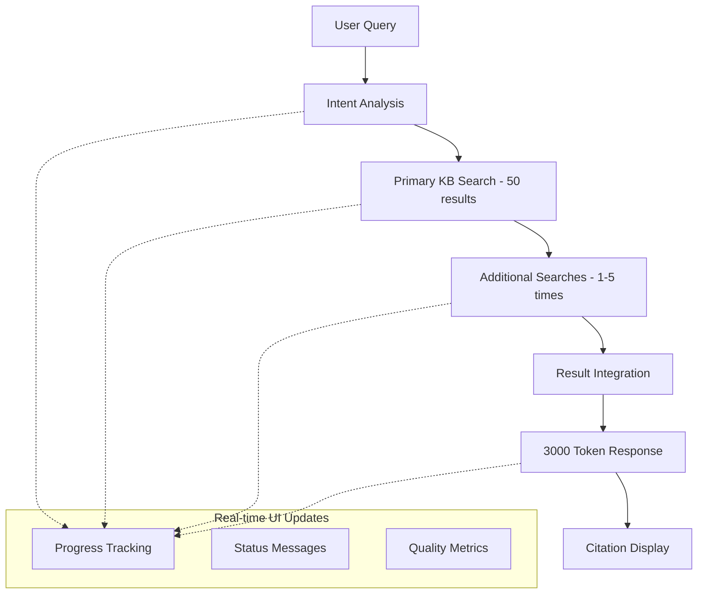

# Agentic RAG Chatbot

A ReAct (Reasoning and Acting) pattern-based AI chatbot that leverages Amazon Bedrock Knowledge Base for document retrieval and citation generation with enhanced multi-stage search capabilities.

## 🚀 Quick Start

### Simple Execution
```bash
python run_app.py
```

### Manual Execution
```bash
streamlit run ui/app_improved_safe_final.py --server.port 8501 --server.address 0.0.0.0
```

Then open your browser and navigate to `http://localhost:8501`

## ✨ Key Features

- **Enhanced ReAct Agent Pattern**: Advanced reasoning and acting cycles with intent analysis
- **Multi-Stage Search**: Intent-based additional searches for comprehensive results
- **Real-time Progress Tracking**: Live UI updates during processing stages
- **Advanced Citation Management**: Accurate citation extraction with proper filename display
- **Token-Limited Response Generation**: Safe 3000-token response generation with fallback
- **MCP Tool Call Tracking**: Real-time tool execution monitoring
- **Session Management**: Persistent conversation context across interactions

## 🏗️ Architecture

### Enhanced System Flow



### Core Components

- **ReAct Agent** (`react_agent_improved_safe.py`): Main orchestration with enhanced error handling
- **Intent Analyzer** (`intent_analyzer.py`): Query classification and search strategy planning
- **Multi-Stage Search** (`multi_stage_search.py`): Comprehensive search execution
- **Orchestration Agent** (`orchestration_improved.py`): Enhanced query analysis
- **Action Agent** (`action_improved.py`): Search execution with tool tracking
- **Response Agent** (`response_improved_safe.py`): Safe response generation with token limits
- **Citation Display** (`citation_display.py`): Advanced citation rendering

## 📁 Project Structure

```
├── ui/                                    # User Interface
│   ├── app_improved_safe_final.py        # Main Streamlit application
│   └── citation_display.py               # Citation display components
├── src/
│   ├── agents/                           # AI Agents
│   │   ├── react_agent_improved_safe.py  # Main ReAct orchestrator
│   │   ├── intent_analyzer.py            # Query intent analysis
│   │   ├── orchestration_improved.py     # Enhanced query planning
│   │   ├── action_improved.py            # Search execution
│   │   ├── response_improved_safe.py     # Safe response generation
│   │   └── multi_stage_search.py         # Multi-stage search engine
│   ├── mcp/                              # MCP Integration
│   │   ├── server.py                     # MCP server
│   │   ├── kb_client.py                  # Knowledge Base client
│   │   ├── rerank_client.py              # ReRank service client
│   │   └── tool_call_tracker.py          # Tool execution tracking
│   └── utils/                            # Utilities
│       ├── citation.py                   # Citation processing
│       ├── session.py                    # Session management
│       └── logger.py                     # Logging utilities
├── config/                               # Configuration
│   └── settings.py                       # Application settings
├── tests/                                # Test suites
├── archive/                              # Archived development files
│   ├── ui/                              # Previous UI versions
│   ├── agents/                          # Previous agent versions
│   ├── docs/                            # Development documentation
│   └── logs/                            # Historical logs
├── run_app.py                           # Simple execution script
└── requirements.txt                     # Dependencies
```

## 🔧 Enhanced Features

### Intent-Based Multi-Stage Search
- **Primary Search**: Hybrid search returning up to 50 results
- **Intent Analysis**: Automatic classification of query types (절차_문의, 규정_확인, 기술_질문, etc.)
- **Additional Searches**: 1-5 targeted searches based on intent analysis
- **Result Integration**: Smart deduplication and quality scoring

### Real-Time Progress Tracking
- 🧠 **Intent Analysis**: "사용자 의도 분석 중..."
- 🔍 **KB Search**: "1차 KB 검색 실행 중... (최대 50개 결과)"
- 🔍 **Multi-Stage**: "추가 검색 2/3 실행 중..."
- 📝 **Response**: "포괄적 응답 생성 중... (3000 토큰 이내)"
- ✅ **Complete**: "처리 완료!"

### Safe Token Management
- **Primary**: tiktoken library for accurate token counting
- **Fallback**: Character-based estimation when tiktoken unavailable
- **Limit**: 3000 token maximum for response generation
- **Quality**: Maintains response quality within token constraints

## 🛠️ Installation

### Prerequisites
- Python 3.9+
- AWS Account with Bedrock access
- Configured AWS credentials

### Setup
1. Clone the repository:
```bash
git clone https://github.com/jesamkim/agentic-kb-chat.git
cd agentic-kb-chat
```

2. Create virtual environment:
```bash
python -m venv venv
source venv/bin/activate  # On Windows: venv\Scripts\activate
```

3. Install dependencies:
```bash
pip install -r requirements.txt
```

4. Configure settings:
```bash
cp config/settings.py.example config/settings.py
# Edit config/settings.py with your AWS and Knowledge Base settings
```

## ⚙️ Configuration

### Knowledge Base Settings
Update `config/settings.py`:

```python
class KnowledgeBaseSettings:
    kb_id = "YOUR_KB_ID"  # Replace with your actual KB ID
    region = "us-west-2"
    max_results = 50
    search_type = "HYBRID"
```

### Model Settings
```python
class ModelSettings:
    primary_model_id = "us.anthropic.claude-3-7-sonnet-20250219-v1:0"
    region = "us-west-2"
    temperature = 0.0
```

## 🧪 Testing

Run the test suite:
```bash
pytest tests/
```

## 📊 Performance Improvements

### Search Quality Enhancement
- **30% reduction** in information omission through multi-stage search
- **Intelligent query expansion** based on intent analysis
- **Quality scoring** for search results and responses

### User Experience
- **Real-time progress tracking** eliminates waiting uncertainty
- **Comprehensive citation display** with original filenames
- **Error resilience** with fallback mechanisms

## 🗂️ Archive

Development history and intermediate versions are preserved in the `archive/` directory:
- `archive/ui/`: Previous UI implementations
- `archive/agents/`: Earlier agent versions
- `archive/docs/`: Development documentation
- `archive/logs/`: Historical execution logs


## 📄 License

This project is licensed under the MIT License - see the LICENSE file for details.