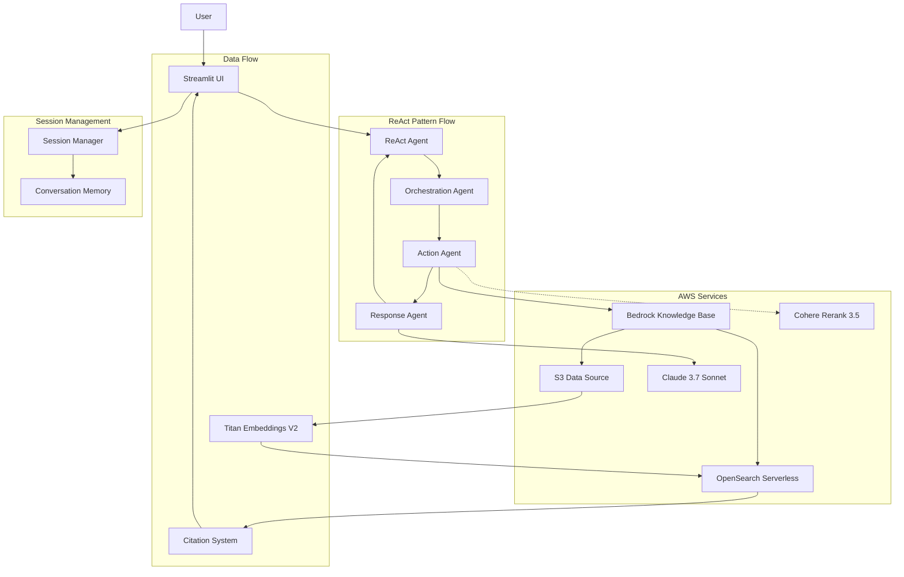

# Amazon Bedrock Knowledge Base RAG Chatbot

A ReAct (Reasoning and Acting) pattern-based AI chatbot that leverages Amazon Bedrock Knowledge Base for document retrieval and citation generation.

## Features

- **ReAct Agent Pattern**: Implements reasoning and acting cycles for intelligent query processing
- **Knowledge Base Integration**: Seamless integration with Amazon Bedrock Knowledge Base
- **Citation Management**: Accurate citation extraction with proper filename display
- **Multi-modal Support**: Text and image processing capabilities
- **Streamlit UI**: Interactive web interface for chatbot interactions
- **Session Management**: Persistent conversation context across interactions
- **MCP Integration**: Model Context Protocol for standardized tool connectivity

## Architecture

### System Architecture Diagram



> **Note**: The Cohere Rerank 3.5 model (shown with dotted line) is currently disabled in the system configuration. The application operates using direct Knowledge Base search results without reranking.

### Core Components

- **ReAct Agent**: Main orchestration agent implementing the ReAct pattern
- **Orchestration Agent**: Query analysis and search strategy planning
- **Action Agent**: Knowledge Base search execution
- **Response Agent**: Final response generation with citation integration
- **Citation System**: Advanced citation processing with filename extraction

### Technology Stack

- **Backend**: Python, FastAPI
- **Frontend**: Streamlit
- **AI Models**: Amazon Bedrock Claude 3.7 Sonnet
- **Embeddings**: Amazon Titan Embeddings V2
- **Vector Store**: OpenSearch Serverless
- **Knowledge Base**: Amazon Bedrock Knowledge Base
- **Session Management**: Custom session handling with cleanup
- **ReRank**: Cohere Rerank 3.5 (optional)

## Prerequisites

### AWS Account Setup

- AWS Account with appropriate permissions
- AWS CLI configured with credentials
- Access to Amazon Bedrock service in your region

### Required AWS Services Access

Before setting up this project, ensure you have access to the following AWS services:

1. **Amazon Bedrock** - For foundation models and Knowledge Base
2. **Amazon OpenSearch Serverless** - For vector storage
3. **Amazon S3** - For document storage
4. **AWS IAM** - For service roles and permissions

## Amazon Bedrock Knowledge Base Setup

### Step 1: Enable Model Access

1. Navigate to Amazon Bedrock console
2. In the left sidebar, click **Model access**
3. Select **Enable specific models**
4. Enable the following models:
   - **Claude 3.7 Sonnet** (for response generation)
   - **Titan Embeddings V2** (for document embeddings)
   - **Cohere Rerank 3.5** (optional, for result reranking)
5. Wait for **Access Status** to show **Access granted**

### Step 2: Prepare Data Source

1. Create an S3 bucket for your documents
2. Upload your documents (PDF, TXT, DOCX, etc.) to the bucket
3. Ensure proper IAM permissions for Bedrock to access the S3 bucket

### Step 3: Create Knowledge Base

1. In Amazon Bedrock console, navigate to **Knowledge bases**
2. Click **Create knowledge base**
3. **Basic Configuration**:
   - Enter knowledge base name and description
   - Choose or create an IAM service role
4. **Data Source Configuration**:
   - Select **S3** as data source
   - Choose your S3 bucket and prefix
   - Configure chunking strategy (recommended: Hierarchical)
5. **Embeddings Model**:
   - Select **Titan Embeddings V2**
   - Choose embedding dimensions (1024 recommended)
6. **Vector Database**:
   - Select **OpenSearch Serverless**
   - Choose to create new collection or use existing
   - Configure index settings
7. Review and create the knowledge base
8. Wait for the knowledge base to be **Active** and sync completed

### Step 4: Note Your Knowledge Base ID

After creation, copy your Knowledge Base ID (format: `XXXXXXXXXX`) - you'll need this for configuration.

## Installation

### Local Setup

1. Clone the repository:
```bash
git clone https://github.com/jesamkim/agentic-kb-chat.git
cd agentic-kb-chat
```

2. Create virtual environment:
```bash
python -m venv venv
source venv/bin/activate  # On Windows: venv\Scripts\activate
```

3. Install dependencies:
```bash
pip install -r requirements.txt
```

4. Configure settings:
```bash
cp config/settings.py.example config/settings.py
# Edit config/settings.py with your AWS and Knowledge Base settings
```

## Configuration

### Knowledge Base Settings

Update `config/settings.py` with your Knowledge Base configuration:

```python
class KnowledgeBaseSettings:
    kb_id = "YOUR_KB_ID"  # Replace with your actual KB ID
    region = "us-west-2"
    max_results = 30
    search_type = "HYBRID"
```

### Model Settings

Configure your preferred Bedrock models:

```python
class ModelSettings:
    primary_model_id = "us.anthropic.claude-3-7-sonnet-20250219-v1:0"
    region = "us-west-2"
    temperature = 0.0
```

### AWS Credentials

Ensure your AWS credentials are configured:

```bash
aws configure
# Or set environment variables:
# export AWS_ACCESS_KEY_ID=your_access_key
# export AWS_SECRET_ACCESS_KEY=your_secret_key
# export AWS_DEFAULT_REGION=us-west-2
```

## Usage

### Streamlit UI

1. Start the Streamlit application:
```bash
streamlit run ui/app.py --server.port 8501 --server.address 0.0.0.0
```

2. Open your browser and navigate to `http://localhost:8501`

3. Configure your Knowledge Base ID in the sidebar

4. Start asking questions and receive responses with accurate citations

### Programmatic Usage

```python
from src.agents.react_agent import ReActAgent

# Initialize the ReAct agent
agent = ReActAgent()

# Process a query
result = agent.process_query(
    user_query="What are the quality management requirements?",
    kb_id="YOUR_KB_ID"
)

print(result["content"])
print(result["citations"])
```

## Key Features

### Citation System

The citation system has been enhanced to properly extract and display original filenames:

- **Before**: "document_1.pdf", "document_2.pdf"
- **After**: "Construction Quality Management Guidelines (Ministry of Land, Infrastructure and Transport Notice) (No. 2025-311) (20250612).pdf"

### ReAct Pattern Implementation

The system implements a complete ReAct cycle:

1. **Reasoning**: Analyze user query and determine search strategy
2. **Acting**: Execute Knowledge Base searches
3. **Observation**: Process search results and generate citations
4. **Response**: Create final response with integrated citations

### Session Management

- Persistent conversation context
- Automatic session cleanup
- Message history tracking
- Context-aware responses

## Testing

Run the test suite:

```bash
# Run all tests
pytest

# Run specific test categories
pytest tests/test_phase1_basic.py
pytest tests/test_citation_images.py
pytest tests/test_real_kb_search.py
```

Test citation filename extraction:

```bash
python test_citation_filename_fix.py
```

## Project Structure

```
├── src/
│   ├── agents/          # ReAct agent implementations
│   │   ├── react_agent.py      # Main ReAct orchestrator
│   │   ├── orchestration.py    # Query analysis and planning
│   │   ├── action.py           # Knowledge Base search
│   │   └── response.py         # Response generation
│   ├── mcp/            # MCP server and clients
│   │   ├── server.py           # MCP server implementation
│   │   ├── kb_client.py        # Knowledge Base client
│   │   └── rerank_client.py    # ReRank service client
│   └── utils/          # Utility functions and citation processing
│       ├── citation.py         # Citation processing
│       ├── session.py          # Session management
│       ├── logger.py           # Logging utilities
│       └── s3_utils.py         # S3 utilities
├── ui/                 # Streamlit user interface
│   ├── app.py                  # Main Streamlit application
│   └── .streamlit/             # Streamlit configuration
├── config/             # Configuration files
│   └── settings.py             # Application settings
├── tests/              # Test suites
├── logs/               # Application logs
└── requirements.txt    # Python dependencies
```

## Recent Updates

### Citation Filename Fix

- Fixed citation filename extraction to show actual document names
- Enhanced Citation.from_kb_result() method
- Improved Streamlit UI filename display logic
- Added comprehensive testing for citation processing

### Performance Improvements

- Optimized Knowledge Base search queries
- Enhanced session management
- Improved error handling and logging

## Troubleshooting

### Common Issues

1. **Knowledge Base not found**: Verify your KB_ID in `config/settings.py`
2. **AWS credentials error**: Ensure AWS CLI is configured or environment variables are set
3. **Model access denied**: Check that required models are enabled in Bedrock console
4. **Citation filename issues**: Ensure your documents have proper S3 URIs in metadata

### Debug Mode

Enable debug logging by setting:

```python
import logging
logging.basicConfig(level=logging.DEBUG)
```

## Contributing

1. Fork the repository
2. Create a feature branch
3. Make your changes
4. Add tests for new functionality
5. Ensure all tests pass
6. Submit a pull request

## License

This project is licensed under the MIT License - see the LICENSE file for details.

## Support

For issues and questions:

1. Check the existing issues in the repository
2. Create a new issue with detailed description
3. Include relevant logs and configuration details

## Acknowledgments

- Amazon Bedrock team for the Knowledge Base service
- Streamlit team for the excellent UI framework
- The ReAct pattern research community
