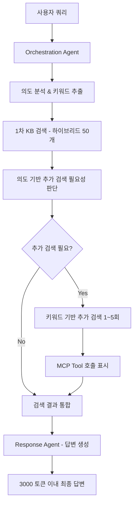

# KB 검색 개선 개발 계획

## 🎯 개선 목표
정보 누락 문제 해결을 위한 **의도 기반 다단계 검색** 시스템 구축

## 📋 현재 문제점 분석
1. **단일 검색의 한계**: 한 번의 KB 검색으로 복잡한 쿼리의 모든 측면을 커버하지 못함
2. **의도 파악 부족**: 사용자 쿼리의 세부 의도를 충분히 분석하지 못함
3. **키워드 기반 보완 검색 부재**: 특정 절차, 규정 등에 대한 추가 검색 없음
4. **검색 결과 통합 부족**: 여러 검색 결과를 효과적으로 통합하지 못함

## 🔄 개선된 데이터 흐름



## 🛠️ 상세 개발 계획

### Phase 1: Orchestration Agent 개선

#### 1.1 의도 분석 강화
**파일**: `src/agents/orchestration.py`

```python
class IntentAnalyzer:
    """사용자 쿼리 의도 분석기"""
    
    def analyze_user_intent(self, query: str, context: Optional[str] = None) -> Dict[str, Any]:
        """
        사용자 쿼리의 의도를 상세 분석
        
        Returns:
            {
                "primary_intent": "절차_문의|규정_확인|기술_질문|일반_정보",
                "secondary_intents": ["관련_절차", "예외_사항", "참고_자료"],
                "key_entities": ["품질관리", "건설", "검사"],
                "search_keywords": ["품질관리 절차", "검사 기준", "승인 프로세스"],
                "complexity_level": "단순|보통|복잡",
                "requires_additional_search": True,
                "additional_search_queries": [
                    "품질관리 절차 단계",
                    "건설 품질 검사 기준",
                    "품질관리 승인 프로세스"
                ]
            }
        """
```

#### 1.2 키워드 추출 로직
```python
def extract_search_keywords(self, intent_analysis: Dict[str, Any]) -> List[str]:
    """
    의도 분석 결과를 바탕으로 추가 검색 키워드 생성
    
    키워드 패턴:
    - "{주제} 절차"
    - "{주제} 기준" 
    - "{주제} 규정"
    - "{주제} 방법"
    - "{주제} 예외사항"
    """
```

### Phase 2: Action Agent 개선

#### 2.1 다단계 검색 실행기
**파일**: `src/agents/action.py`

```python
class MultiStageSearchExecutor:
    """다단계 검색 실행기"""
    
    def execute_multi_stage_search(
        self,
        analysis_result: Dict[str, Any],
        max_additional_searches: int = 5
    ) -> Dict[str, Any]:
        """
        다단계 검색 실행
        
        1. 1차 하이브리드 검색 (50개)
        2. 의도 기반 추가 검색 (1~5회)
        3. 검색 결과 통합 및 중복 제거
        """
        
    def perform_primary_search(self, query: str) -> Dict[str, Any]:
        """1차 하이브리드 검색 - 50개 결과"""
        
    def perform_additional_searches(
        self, 
        additional_queries: List[str],
        primary_results: List[Dict[str, Any]]
    ) -> List[Dict[str, Any]]:
        """의도 기반 추가 검색"""
        
    def integrate_search_results(
        self,
        primary_results: List[Dict[str, Any]],
        additional_results: List[List[Dict[str, Any]]]
    ) -> Dict[str, Any]:
        """검색 결과 통합 및 중복 제거"""
```

#### 2.2 MCP Tool 호출 표시 시스템
**파일**: `src/mcp/server.py`

```python
class MCPToolCallTracker:
    """MCP Tool 호출 추적 및 표시"""
    
    def track_tool_call(
        self,
        tool_name: str,
        parameters: Dict[str, Any],
        stage: str = "additional_search"
    ) -> str:
        """
        Tool 호출 추적 및 UI 표시용 메시지 생성
        
        Returns:
            "🔍 추가 검색 중: '품질관리 절차' 키워드로 KB 검색..."
        """
```

### Phase 3: Response Agent 개선

#### 3.1 통합 응답 생성기
**파일**: `src/agents/response.py`

```python
class IntegratedResponseGenerator:
    """통합 응답 생성기"""
    
    def generate_comprehensive_response(
        self,
        user_query: str,
        integrated_results: Dict[str, Any],
        intent_analysis: Dict[str, Any],
        max_tokens: int = 3000
    ) -> Dict[str, Any]:
        """
        통합된 검색 결과를 바탕으로 포괄적 응답 생성
        
        응답 구조:
        1. 직접적 답변 (핵심 정보)
        2. 관련 절차/규정 (추가 검색 결과)
        3. 참고사항 및 예외사항
        4. Citation 정보
        """
        
    def prioritize_citations(
        self,
        all_citations: List[Dict[str, Any]],
        intent_analysis: Dict[str, Any]
    ) -> List[Dict[str, Any]]:
        """의도 기반 Citation 우선순위 정렬"""
```

### Phase 4: UI 개선

#### 4.1 Streamlit UI 개선
**파일**: `ui/app.py`

```python
def display_mcp_tool_calls(tool_calls: List[Dict[str, Any]]):
    """MCP Tool 호출 과정을 실시간으로 표시"""
    
def display_search_progress(search_stages: List[Dict[str, Any]]):
    """
    검색 진행 상황 표시:
    ✅ 1차 검색 완료 (50개 결과)
    🔍 추가 검색 1/3: "품질관리 절차"
    🔍 추가 검색 2/3: "검사 기준"
    ✅ 검색 완료 - 총 73개 결과 통합
    """
```

## 📁 파일별 수정 계획

### 1. `src/agents/orchestration.py` 수정
- [ ] `IntentAnalyzer` 클래스 추가
- [ ] `analyze_user_intent()` 메서드 구현
- [ ] `extract_search_keywords()` 메서드 구현
- [ ] 기존 `analyze_query()` 메서드 개선

### 2. `src/agents/action.py` 수정
- [ ] `MultiStageSearchExecutor` 클래스 추가
- [ ] `execute_multi_stage_search()` 메서드 구현
- [ ] `perform_additional_searches()` 메서드 구현
- [ ] `integrate_search_results()` 메서드 구현

### 3. `src/agents/response.py` 수정
- [ ] `IntegratedResponseGenerator` 클래스 추가
- [ ] `generate_comprehensive_response()` 메서드 구현
- [ ] `prioritize_citations()` 메서드 구현
- [ ] 3000 토큰 제한 로직 추가

### 4. `src/mcp/server.py` 수정
- [ ] `MCPToolCallTracker` 클래스 추가
- [ ] Tool 호출 추적 로직 구현
- [ ] UI 표시용 메시지 생성 로직

### 5. `ui/app.py` 수정
- [ ] `display_mcp_tool_calls()` 함수 추가
- [ ] `display_search_progress()` 함수 추가
- [ ] 실시간 진행 상황 표시 로직

### 6. `config/settings.py` 수정
- [ ] 다단계 검색 관련 설정 추가
- [ ] 최대 추가 검색 횟수 설정
- [ ] 응답 토큰 제한 설정

## 🔧 구현 세부사항

### 의도 분석 프롬프트 템플릿
```python
INTENT_ANALYSIS_PROMPT = """
사용자 쿼리를 분석하여 다음 정보를 JSON 형태로 추출하세요:

사용자 쿼리: "{user_query}"

분석 항목:
1. primary_intent: 주요 의도 (절차_문의, 규정_확인, 기술_질문, 일반_정보 중 하나)
2. key_entities: 핵심 개체명 (최대 5개)
3. search_keywords: 추가 검색용 키워드 (최대 5개)
4. requires_additional_search: 추가 검색 필요 여부 (boolean)
5. additional_search_queries: 추가 검색 쿼리 목록 (최대 5개)

출력 형식: JSON
"""
```

### 검색 결과 통합 로직
```python
def integrate_and_deduplicate_results(
    primary_results: List[Dict],
    additional_results: List[List[Dict]]
) -> List[Dict]:
    """
    검색 결과 통합 및 중복 제거
    
    중복 제거 기준:
    1. 동일한 문서 ID
    2. 유사한 텍스트 내용 (코사인 유사도 > 0.9)
    3. 동일한 S3 URI
    
    우선순위:
    1. 1차 검색 결과 우선
    2. 신뢰도 점수 높은 순
    3. 최신 문서 우선
    """
```

### 응답 생성 구조화
```python
RESPONSE_TEMPLATE = """
## 직접적 답변
{direct_answer}

## 관련 절차 및 규정
{procedures_and_regulations}

## 참고사항
{additional_notes}

## 예외사항 및 주의점
{exceptions_and_warnings}

---
*참고문서: {citation_count}개 문서 참조*
"""
```

## 📊 성능 지표

### 개선 전후 비교 지표
1. **정보 완성도**: Citation 커버리지 증가 목표 30%
2. **응답 품질**: 사용자 만족도 향상
3. **검색 효율성**: 평균 검색 시간 < 10초
4. **토큰 효율성**: 3000 토큰 이내 응답 생성

### 모니터링 메트릭
- 1차 검색 결과 수
- 추가 검색 실행 횟수
- 최종 Citation 수
- 응답 생성 시간
- 토큰 사용량

## 🧪 테스트 계획

### 단위 테스트
- [ ] 의도 분석 정확성 테스트
- [ ] 키워드 추출 로직 테스트
- [ ] 검색 결과 통합 테스트
- [ ] 중복 제거 로직 테스트

### 통합 테스트
- [ ] 전체 다단계 검색 플로우 테스트
- [ ] UI 표시 기능 테스트
- [ ] 성능 벤치마크 테스트

### 사용자 시나리오 테스트
- [ ] 복잡한 절차 문의 테스트
- [ ] 다중 주제 질문 테스트
- [ ] 예외사항 포함 질문 테스트

## 📅 개발 일정

### Week 1: 핵심 로직 구현
- Day 1-2: Orchestration Agent 의도 분석 구현
- Day 3-4: Action Agent 다단계 검색 구현
- Day 5: Response Agent 통합 응답 생성 구현

### Week 2: UI 및 통합
- Day 1-2: Streamlit UI 개선
- Day 3-4: MCP Tool 호출 표시 시스템
- Day 5: 전체 통합 및 테스트

### Week 3: 최적화 및 테스트
- Day 1-3: 성능 최적화
- Day 4-5: 종합 테스트 및 버그 수정

## 🚀 배포 계획

1. **개발 환경 테스트**: 로컬 환경에서 기능 검증
2. **스테이징 테스트**: 실제 KB 데이터로 테스트
3. **점진적 배포**: 기존 기능과 병행 운영
4. **모니터링**: 성능 지표 추적 및 개선

이 계획을 바탕으로 단계별로 구현을 진행하시겠습니까?
