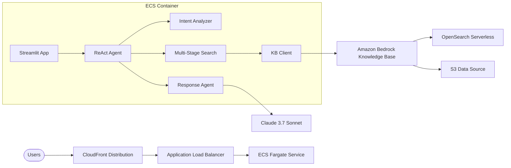

# Agentic RAG Chatbot - AWS CDK Deployment

This directory contains AWS CDK infrastructure code to deploy the Agentic RAG Chatbot to AWS using a CloudFront -> ALB -> ECS Fargate architecture.

## Architecture



## Prerequisites

### 1. AWS Account Setup
- AWS CLI configured with appropriate credentials
- AWS CDK installed: `npm install -g aws-cdk`
- Python 3.9+ installed

### 2. Amazon Bedrock Knowledge Base
- Knowledge Base created and active
- Knowledge Base ID available
- Required models enabled in Bedrock:
  - Claude 3.7 Sonnet
  - Titan Embeddings V2

### 3. Required Permissions
Your AWS credentials need permissions for:
- CloudFormation
- ECS/Fargate
- EC2 (VPC, Security Groups)
- Application Load Balancer
- CloudFront
- IAM (roles and policies)
- CloudWatch Logs

## Quick Deployment

### 1. Set Environment Variables
```bash
export KB_ID="your_knowledge_base_id"
export AWS_REGION="us-west-2"  # Optional, defaults to us-west-2
```

### 2. Deploy
```bash
cd cdk-deploy
./deploy.sh
```

The deployment script will:
- Create Python virtual environment
- Install dependencies
- Bootstrap CDK (if needed)
- Deploy the stack
- Provide the CloudFront URL

## Manual Deployment

### 1. Setup Environment
```bash
cd cdk-deploy
python3 -m venv venv
source venv/bin/activate
pip install -r requirements.txt
```

### 2. Configure Environment Variables
```bash
export KB_ID="your_knowledge_base_id"
export AWS_REGION="us-west-2"
```

### 3. Bootstrap CDK (first time only)
```bash
cdk bootstrap
```

### 4. Deploy Stack
```bash
cdk synth  # Optional: review generated CloudFormation
cdk deploy
```

## Configuration

### Environment Variables
- `KB_ID` (required): Your Amazon Bedrock Knowledge Base ID
- `AWS_REGION` (optional): AWS region, defaults to us-west-2
- `MODEL_ID` (optional): Bedrock model ID, defaults to Claude 3.7 Sonnet
- `LOG_LEVEL` (optional): Logging level, defaults to INFO

### Resource Configuration
Edit `docker_app/config_file.py` to modify:
- ECS task CPU/memory
- Auto scaling parameters
- Health check settings
- CloudFront caching behavior

## Architecture Components

### 1. VPC and Networking
- VPC with public and private subnets across 2 AZs
- NAT Gateway for outbound internet access
- Security groups with minimal required permissions

### 2. ECS Fargate Service
- Containerized Streamlit application
- Auto scaling based on CPU and memory utilization
- Health checks and graceful deployments
- CloudWatch logging

### 3. Application Load Balancer
- Internet-facing ALB in public subnets
- Health checks to ECS service
- Custom header validation for CloudFront

### 4. CloudFront Distribution
- Global content delivery network
- HTTPS enforcement
- Custom header for origin security
- Caching disabled for dynamic content

### 5. IAM Roles and Policies
- ECS task role with Bedrock permissions
- Execution role for container management
- Minimal required permissions

## Monitoring and Troubleshooting

### Check Deployment Status
```bash
# ECS Service Status
aws ecs describe-services --cluster agentic-rag-chatbot-cluster --services agentic-rag-chatbot-service

# CloudFormation Stack Status
aws cloudformation describe-stacks --stack-name agentic-rag-chatbot

# View Logs
aws logs tail /ecs/agentic-rag-chatbot --follow
```

### Common Issues

1. **KB_ID not set**: Ensure environment variable is exported
2. **Health check failures**: Check ECS task logs for application errors
3. **502/503 errors**: Verify target group health and security group rules
4. **Slow startup**: Initial container startup can take 2-3 minutes

### Health Check Endpoint
The application includes a health check endpoint at `/?health=check` that returns:
```json
{
  "status": "healthy",
  "timestamp": "2024-01-01T00:00:00",
  "version": "1.0.0",
  "service": "agentic-rag-chatbot"
}
```

## Cleanup

To remove all resources:
```bash
cdk destroy
```

## Cost Optimization

### Estimated Monthly Costs (us-west-2)
- **ECS Fargate**: ~$30-50 (1 task, 1 vCPU, 2GB RAM)
- **Application Load Balancer**: ~$20
- **CloudFront**: ~$1-5 (depending on usage)
- **NAT Gateway**: ~$45
- **Total**: ~$100-120/month

### Cost Reduction Options
1. Use Fargate Spot for non-production workloads
2. Implement CloudFront caching for static assets
3. Use scheduled scaling to reduce capacity during off-hours
4. Consider using VPC endpoints to eliminate NAT Gateway costs

## Security Features

- **Network Isolation**: ECS tasks in private subnets
- **Custom Headers**: CloudFront to ALB authentication
- **HTTPS Enforcement**: All traffic encrypted in transit
- **Minimal IAM Permissions**: Least privilege access
- **Security Groups**: Restrictive ingress rules

## Scaling

The deployment includes automatic scaling based on:
- **CPU Utilization**: Target 70%
- **Memory Utilization**: Target 80%
- **Capacity**: 1-3 tasks (configurable)

## Support

For issues with the deployment:
1. Check CloudWatch logs for application errors
2. Verify all prerequisites are met
3. Ensure environment variables are correctly set
4. Review AWS service quotas and limits
